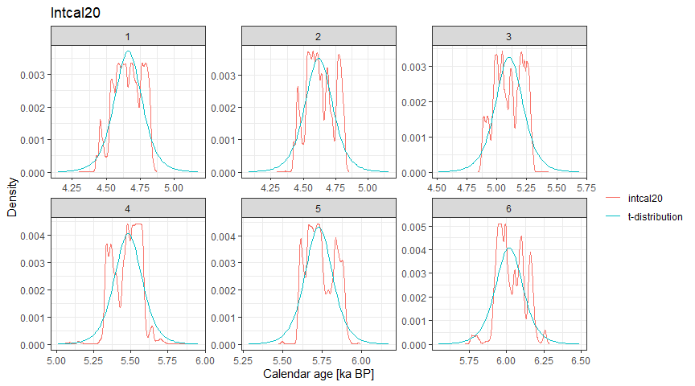

hamstrbacon: An Interface Between rbacon and hamstr.
================
Andrew M. Dolman
2022-01-02

------------------------------------------------------------------------

## Installation

**hamstrbacon** can be installed directly from Github

``` r
if (!require("remotes")) {
  install.packages("remotes")
}

remotes::install_github("earthsystemdiagnostics/hamstrbacon")
```

## Using **hamstr**

Examples using the example core “MSB2K” from the
[rbacon](https://cran.r-project.org/web/packages/rbacon/index.html)
package.

``` r
library(hamstrbacon)

set.seed(20200827)
```

### Fitting age-models with **rbacon** via **hamstrbacon**

``` r
MSB2K <- hamstr::MSB2K

hambac_1 <- hamstr_bacon(id = "tst", 
                         depth = MSB2K$depth,
                               obs_age = MSB2K$age,
                               obs_err = MSB2K$error,
                               thick = 5, cc = 1,
                         close.connections = FALSE)
#> The run's files will be put in this folder: C:\Users\Andrew\AppData\Local\Temp/Rtmpcf5mzg
#> Warning in file(con, "r"): file("") only supports open = "w+" and open = "w+b":
#> using the former
#> Reading C:\Users\Andrew\AppData\Local\Temp/Rtmpcf5mzg/Rtmpcf5mzg_21.bacon
#> Constant calibration curve.
#> IntCal20: Reading from file: C:\Users\Andrew\Documents\R\win-library\4.1\IntCal\extdata/3Col_intcal20.14C
#> Marine20: Reading from file: C:\Users\Andrew\Documents\R\win-library\4.1\IntCal\extdata/3Col_marine20.14C
#> SHCal20: Reading from file: C:\Users\Andrew\Documents\R\win-library\4.1\IntCal\extdata/3Col_shcal20.14C
#> Added det: tst: 4128.0+-65.0   d=1.5 ResCorr=   0.0+-0.0    a=3 b=4 cc=IntCal20
#> Added det: tst: 4106.0+-60.0   d=4.5 ResCorr=   0.0+-0.0    a=3 b=4 cc=IntCal20
#> Added det: tst: 4046.0+-59.0   d=8.5 ResCorr=   0.0+-0.0    a=3 b=4 cc=IntCal20
#> Added det: tst: 4184.0+-58.0   d=12.5 ResCorr=   0.0+-0.0    a=3 b=4 cc=IntCal20
#> Added det: tst: 4076.0+-62.0   d=14.5 ResCorr=   0.0+-0.0    a=3 b=4 cc=IntCal20
#> Added det: tst: 4107.0+-61.0   d=14.5 ResCorr=   0.0+-0.0    a=3 b=4 cc=IntCal20
#> Added det: tst: 4097.0+-58.0   d=14.5 ResCorr=   0.0+-0.0    a=3 b=4 cc=IntCal20
#> Added det: tst: 4177.0+-53.0   d=17.5 ResCorr=   0.0+-0.0    a=3 b=4 cc=IntCal20
#> Added det: tst: 4220.0+-59.0   d=20.5 ResCorr=   0.0+-0.0    a=3 b=4 cc=IntCal20
#> Added det: tst: 4281.0+-64.0   d=21.5 ResCorr=   0.0+-0.0    a=3 b=4 cc=IntCal20
#> Added det: tst: 4374.0+-64.0   d=21.5 ResCorr=   0.0+-0.0    a=3 b=4 cc=IntCal20
#> Added det: tst: 4493.0+-62.0   d=22.5 ResCorr=   0.0+-0.0    a=3 b=4 cc=IntCal20
#> Added det: tst: 4452.0+-52.0   d=28.5 ResCorr=   0.0+-0.0    a=3 b=4 cc=IntCal20
#> Added det: tst: 4616.0+-64.0   d=31.5 ResCorr=   0.0+-0.0    a=3 b=4 cc=IntCal20
#> Added det: tst: 4662.0+-64.0   d=32.5 ResCorr=   0.0+-0.0    a=3 b=4 cc=IntCal20
#> Added det: tst: 4743.0+-67.0   d=33.5 ResCorr=   0.0+-0.0    a=3 b=4 cc=IntCal20
#> Added det: tst: 4638.0+-67.0   d=34.5 ResCorr=   0.0+-0.0    a=3 b=4 cc=IntCal20
#> Added det: tst: 4810.0+-67.0   d=37.5 ResCorr=   0.0+-0.0    a=3 b=4 cc=IntCal20
#> Added det: tst: 4757.0+-82.0   d=38.5 ResCorr=   0.0+-0.0    a=3 b=4 cc=IntCal20
#> Added det: tst: 4839.0+-59.0   d=41.5 ResCorr=   0.0+-0.0    a=3 b=4 cc=IntCal20
#> Added det: tst: 4913.0+-65.0   d=43.5 ResCorr=   0.0+-0.0    a=3 b=4 cc=IntCal20
#> Added det: tst: 4880.0+-57.0   d=46.5 ResCorr=   0.0+-0.0    a=3 b=4 cc=IntCal20
#> Added det: tst: 4989.0+-70.0   d=47.5 ResCorr=   0.0+-0.0    a=3 b=4 cc=IntCal20
#> Added det: tst: 5070.0+-66.0   d=48.5 ResCorr=   0.0+-0.0    a=3 b=4 cc=IntCal20
#> Added det: tst: 4993.0+-67.0   d=49.5 ResCorr=   0.0+-0.0    a=3 b=4 cc=IntCal20
#> Added det: tst: 5115.0+-79.0   d=50.5 ResCorr=   0.0+-0.0    a=3 b=4 cc=IntCal20
#> Added det: tst: 5026.0+-51.0   d=52.5 ResCorr=   0.0+-0.0    a=3 b=4 cc=IntCal20
#> Added det: tst: 5242.0+-64.0   d=53.5 ResCorr=   0.0+-0.0    a=3 b=4 cc=IntCal20
#> Added det: tst: 5159.0+-50.0   d=54.5 ResCorr=   0.0+-0.0    a=3 b=4 cc=IntCal20
#> Added det: tst: 5130.0+-66.0   d=55.5 ResCorr=   0.0+-0.0    a=3 b=4 cc=IntCal20
#> Added det: tst: 5238.0+-65.0   d=58.5 ResCorr=   0.0+-0.0    a=3 b=4 cc=IntCal20
#> Added det: tst: 5293.0+-38.0   d=59.5 ResCorr=   0.0+-0.0    a=3 b=4 cc=IntCal20
#> Added det: tst: 5293.0+-54.0   d=64.5 ResCorr=   0.0+-0.0    a=3 b=4 cc=IntCal20
#> Added det: tst: 5368.0+-51.0   d=70.5 ResCorr=   0.0+-0.0    a=3 b=4 cc=IntCal20
#> Added det: tst: 5498.0+-69.0   d=71.5 ResCorr=   0.0+-0.0    a=3 b=4 cc=IntCal20
#> Added det: tst: 5588.0+-55.0   d=73.5 ResCorr=   0.0+-0.0    a=3 b=4 cc=IntCal20
#> Added det: tst: 5514.0+-57.0   d=75.5 ResCorr=   0.0+-0.0    a=3 b=4 cc=IntCal20
#> Added det: tst: 5535.0+-52.0   d=77.5 ResCorr=   0.0+-0.0    a=3 b=4 cc=IntCal20
#> Added det: tst: 5644.0+-77.0   d=79.5 ResCorr=   0.0+-0.0    a=3 b=4 cc=IntCal20
#> Added det: tst: 5885.0+-45.0   d=99.5 ResCorr=   0.0+-0.0    a=3 b=4 cc=IntCal20
#> BaconFixed: Bacon jumps model with fixed c's.
#>             K=21, H=0, dim=23, Seed=968424, Dc=5.000000, c(0)=1.500000, c(K)=106.500000
#> 
#> twalk:      5060000 iterations to run, Sun Jan 02 17:42:59 2022
#>        
#> twalk thinning: 1 out of every 115 accepted iterations will be saved in file C:\Users\Andrew\AppData\Local\Temp/Rtmpcf5mzg/Rtmpcf5mzg_21.out
#> twalk: Finished,  0.7% of moved pars per iteration (ratio 35960.826087/5060000). Output in file C:\Users\Andrew\AppData\Local\Temp/Rtmpcf5mzg/Rtmpcf5mzg_21.out,
#>       Sun Jan 02 17:43:25 2022
#> 
#> bacon: burn in (initial iterations which will be removed): 23000
#> Eso es to...eso es to...eso es to...eso es toooodo amigos!
#> Warning in file.remove(i): cannot remove file 'C:
#> \Users\Andrew\AppData\Local\Temp/Rtmpcf5mzg/Rtmpcf5mzg_21.bacon', reason
#> 'Permission denied'
#> Previous runs of core Rtmpcf5mzg with thick=5 cm deleted. Now try running the core again
```

``` r
plot(hambac_1)
```

<!-- -->

``` r
summary(hambac_1)
#> # A tibble: 22 x 8
#>    depth  mean    sd `2.5%` `25%` `50%` `75%` `97.5%`
#>    <dbl> <dbl> <dbl>  <dbl> <dbl> <dbl> <dbl>   <dbl>
#>  1   1.5 4540.  66.8  4416. 4494. 4543. 4587.   4661.
#>  2   6.5 4614.  66.7  4479. 4566. 4616. 4664.   4739.
#>  3  11.5 4685.  65.2  4551. 4636. 4695. 4737.   4789.
#>  4  16.5 4753.  63.4  4612. 4706. 4776. 4803.   4838.
#>  5  21.5 4873.  53.8  4786. 4843. 4860. 4892.   5013.
#>  6  26.5 5080.  97.4  4896. 5003. 5087. 5155.   5248.
#>  7  31.5 5335.  61.3  5222. 5296. 5326. 5381.   5449.
#>  8  36.5 5477.  44.6  5382. 5449. 5477. 5505.   5563.
#>  9  41.5 5580.  44.7  5490. 5554. 5581. 5603.   5672.
#> 10  46.5 5684.  56.5  5592. 5646. 5682. 5711.   5833.
#> # ... with 12 more rows
```

``` r
predict(hambac_1)
#> # A tibble: 61,710 x 3
#>     iter depth   age
#>    <dbl> <dbl> <dbl>
#>  1   501   1.5 4554.
#>  2   501   6.5 4644.
#>  3   501  11.5 4765.
#>  4   501  16.5 4767.
#>  5   501  21.5 4893.
#>  6   501  26.5 5243.
#>  7   501  31.5 5295.
#>  8   501  36.5 5412.
#>  9   501  41.5 5515.
#> 10   501  46.5 5721.
#> # ... with 61,700 more rows
```

``` r
plot(hambac_1, type = "acc")
#> Joining, by = "depth"
```

<!-- -->

If you want specific depths you can ask for them and the age models will
be linearly interpolated

``` r
spec_depths <- predict(hambac_1, depth = c(10:15))

spec_depths
#> # A tibble: 16,830 x 3
#>     iter depth   age
#>    <int> <int> <dbl>
#>  1     1    10 4729.
#>  2     1    11 4753.
#>  3     1    12 4765.
#>  4     1    13 4766.
#>  5     1    14 4766.
#>  6     1    15 4766.
#>  7     2    10 4728.
#>  8     2    11 4750.
#>  9     2    12 4762.
#> 10     2    13 4764.
#> # ... with 16,820 more rows
```

Summary also works after interpolation

``` r
summary(spec_depths)
#> # A tibble: 6 x 8
#>   depth  mean    sd `2.5%` `25%` `50%` `75%` `97.5%`
#>   <int> <dbl> <dbl>  <dbl> <dbl> <dbl> <dbl>   <dbl>
#> 1    10 4664.  61.4  4538. 4619. 4670. 4712.   4769.
#> 2    11 4678.  63.6  4548. 4630. 4687. 4729.   4781.
#> 3    12 4692.  63.6  4563. 4644. 4703. 4743.   4791.
#> 4    13 4706.  61.3  4576. 4659. 4723. 4755.   4796.
#> 5    14 4719.  60.2  4589. 4674. 4744. 4767.   4802.
#> 6    15 4733.  60.5  4599. 4688. 4759. 4781.   4811.
```

### References

-   Blaauw, Maarten, and J. Andrés Christen. 2011. Flexible Paleoclimate
    Age-Depth Models Using an Autoregressive Gamma Process. Bayesian
    Analysis 6 (3): 457-74. <doi:10.1214/ba/1339616472>.
