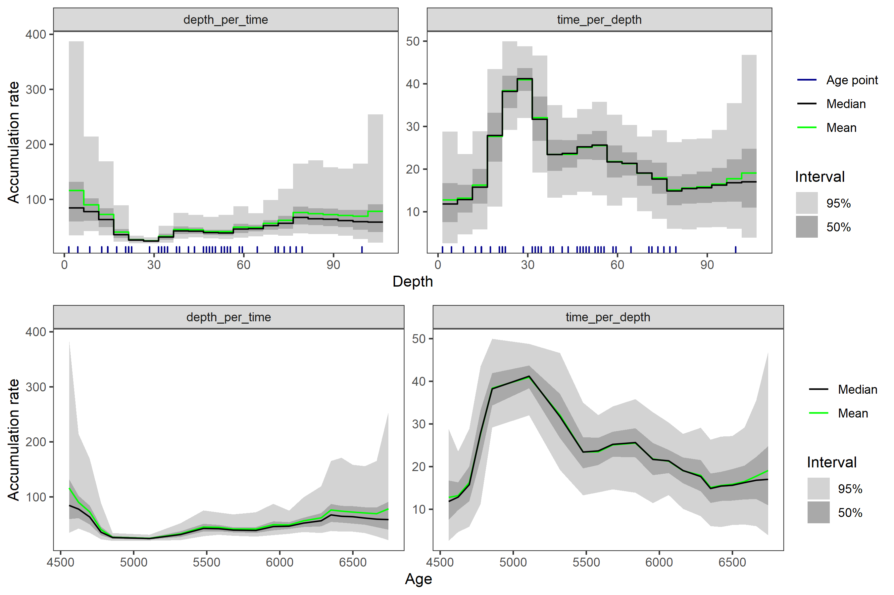

hamstrbacon: An Interface Between rbacon and hamstr.
================
Andrew M. Dolman
2022-01-03

------------------------------------------------------------------------

## Installation

**hamstrbacon** can be installed directly from Github

``` r
if (!require("remotes")) {
  install.packages("remotes")
}

remotes::install_github("earthsystemdiagnostics/hamstrbacon")
```

## Fitting age-models with **rbacon** via **hamstrbacon**

Using the example core “MSB2K” from the
[rbacon](https://cran.r-project.org/web/packages/rbacon/index.html)
package.

``` r
library(hamstrbacon)
```

``` r
hambac_1 <- hamstr_bacon(id = "tst", 
                         depth = MSB2K$depth,
                         obs_age = MSB2K$age,
                         obs_err = MSB2K$error,
                         thick = 5, cc = 1,
                         # pass seed to rbacon so that mcmc sample is the same
                         # each time for the example
                         seed = 20220103
                         )
#> The run's files will be put in this folder: C:\Users\Andrew\AppData\Local\Temp/RtmpcL1Pso
#> Warning in file(con, "r"): file("") only supports open = "w+" and open = "w+b":
#> using the former
#> Reading C:\Users\Andrew\AppData\Local\Temp/RtmpcL1Pso/RtmpcL1Pso_21.bacon
#> Constant calibration curve.
#> IntCal20: Reading from file: C:\Users\Andrew\Documents\R\win-library\4.1\IntCal\extdata/3Col_intcal20.14C
#> Marine20: Reading from file: C:\Users\Andrew\Documents\R\win-library\4.1\IntCal\extdata/3Col_marine20.14C
#> SHCal20: Reading from file: C:\Users\Andrew\Documents\R\win-library\4.1\IntCal\extdata/3Col_shcal20.14C
#> Added det: tst: 4128.0+-65.0   d=1.5 ResCorr=   0.0+-0.0    a=3 b=4 cc=IntCal20
#> Added det: tst: 4106.0+-60.0   d=4.5 ResCorr=   0.0+-0.0    a=3 b=4 cc=IntCal20
#> Added det: tst: 4046.0+-59.0   d=8.5 ResCorr=   0.0+-0.0    a=3 b=4 cc=IntCal20
#> Added det: tst: 4184.0+-58.0   d=12.5 ResCorr=   0.0+-0.0    a=3 b=4 cc=IntCal20
#> Added det: tst: 4076.0+-62.0   d=14.5 ResCorr=   0.0+-0.0    a=3 b=4 cc=IntCal20
#> Added det: tst: 4107.0+-61.0   d=14.5 ResCorr=   0.0+-0.0    a=3 b=4 cc=IntCal20
#> Added det: tst: 4097.0+-58.0   d=14.5 ResCorr=   0.0+-0.0    a=3 b=4 cc=IntCal20
#> Added det: tst: 4177.0+-53.0   d=17.5 ResCorr=   0.0+-0.0    a=3 b=4 cc=IntCal20
#> Added det: tst: 4220.0+-59.0   d=20.5 ResCorr=   0.0+-0.0    a=3 b=4 cc=IntCal20
#> Added det: tst: 4281.0+-64.0   d=21.5 ResCorr=   0.0+-0.0    a=3 b=4 cc=IntCal20
#> Added det: tst: 4374.0+-64.0   d=21.5 ResCorr=   0.0+-0.0    a=3 b=4 cc=IntCal20
#> Added det: tst: 4493.0+-62.0   d=22.5 ResCorr=   0.0+-0.0    a=3 b=4 cc=IntCal20
#> Added det: tst: 4452.0+-52.0   d=28.5 ResCorr=   0.0+-0.0    a=3 b=4 cc=IntCal20
#> Added det: tst: 4616.0+-64.0   d=31.5 ResCorr=   0.0+-0.0    a=3 b=4 cc=IntCal20
#> Added det: tst: 4662.0+-64.0   d=32.5 ResCorr=   0.0+-0.0    a=3 b=4 cc=IntCal20
#> Added det: tst: 4743.0+-67.0   d=33.5 ResCorr=   0.0+-0.0    a=3 b=4 cc=IntCal20
#> Added det: tst: 4638.0+-67.0   d=34.5 ResCorr=   0.0+-0.0    a=3 b=4 cc=IntCal20
#> Added det: tst: 4810.0+-67.0   d=37.5 ResCorr=   0.0+-0.0    a=3 b=4 cc=IntCal20
#> Added det: tst: 4757.0+-82.0   d=38.5 ResCorr=   0.0+-0.0    a=3 b=4 cc=IntCal20
#> Added det: tst: 4839.0+-59.0   d=41.5 ResCorr=   0.0+-0.0    a=3 b=4 cc=IntCal20
#> Added det: tst: 4913.0+-65.0   d=43.5 ResCorr=   0.0+-0.0    a=3 b=4 cc=IntCal20
#> Added det: tst: 4880.0+-57.0   d=46.5 ResCorr=   0.0+-0.0    a=3 b=4 cc=IntCal20
#> Added det: tst: 4989.0+-70.0   d=47.5 ResCorr=   0.0+-0.0    a=3 b=4 cc=IntCal20
#> Added det: tst: 5070.0+-66.0   d=48.5 ResCorr=   0.0+-0.0    a=3 b=4 cc=IntCal20
#> Added det: tst: 4993.0+-67.0   d=49.5 ResCorr=   0.0+-0.0    a=3 b=4 cc=IntCal20
#> Added det: tst: 5115.0+-79.0   d=50.5 ResCorr=   0.0+-0.0    a=3 b=4 cc=IntCal20
#> Added det: tst: 5026.0+-51.0   d=52.5 ResCorr=   0.0+-0.0    a=3 b=4 cc=IntCal20
#> Added det: tst: 5242.0+-64.0   d=53.5 ResCorr=   0.0+-0.0    a=3 b=4 cc=IntCal20
#> Added det: tst: 5159.0+-50.0   d=54.5 ResCorr=   0.0+-0.0    a=3 b=4 cc=IntCal20
#> Added det: tst: 5130.0+-66.0   d=55.5 ResCorr=   0.0+-0.0    a=3 b=4 cc=IntCal20
#> Added det: tst: 5238.0+-65.0   d=58.5 ResCorr=   0.0+-0.0    a=3 b=4 cc=IntCal20
#> Added det: tst: 5293.0+-38.0   d=59.5 ResCorr=   0.0+-0.0    a=3 b=4 cc=IntCal20
#> Added det: tst: 5293.0+-54.0   d=64.5 ResCorr=   0.0+-0.0    a=3 b=4 cc=IntCal20
#> Added det: tst: 5368.0+-51.0   d=70.5 ResCorr=   0.0+-0.0    a=3 b=4 cc=IntCal20
#> Added det: tst: 5498.0+-69.0   d=71.5 ResCorr=   0.0+-0.0    a=3 b=4 cc=IntCal20
#> Added det: tst: 5588.0+-55.0   d=73.5 ResCorr=   0.0+-0.0    a=3 b=4 cc=IntCal20
#> Added det: tst: 5514.0+-57.0   d=75.5 ResCorr=   0.0+-0.0    a=3 b=4 cc=IntCal20
#> Added det: tst: 5535.0+-52.0   d=77.5 ResCorr=   0.0+-0.0    a=3 b=4 cc=IntCal20
#> Added det: tst: 5644.0+-77.0   d=79.5 ResCorr=   0.0+-0.0    a=3 b=4 cc=IntCal20
#> Added det: tst: 5885.0+-45.0   d=99.5 ResCorr=   0.0+-0.0    a=3 b=4 cc=IntCal20
#> BaconFixed: Bacon jumps model with fixed c's.
#>             K=21, H=0, dim=23, Seed=20220103, Dc=5.000000, c(0)=1.500000, c(K)=106.500000
#> 
#> twalk:      5060000 iterations to run, Mon Jan 03 12:14:29 2022
#>        
#> twalk thinning: 1 out of every 115 accepted iterations will be saved in file C:\Users\Andrew\AppData\Local\Temp/RtmpcL1Pso/RtmpcL1Pso_21.out
#> twalk: Finished,  0.7% of moved pars per iteration (ratio 35148.956522/5060000). Output in file C:\Users\Andrew\AppData\Local\Temp/RtmpcL1Pso/RtmpcL1Pso_21.out,
#>       Mon Jan 03 12:14:53 2022
#> 
#> bacon: burn in (initial iterations which will be removed): 23000
#> Eso es to...eso es to...eso es to...eso es toooodo amigos!
#> Warning in file.remove(i): cannot remove file 'C:
#> \Users\Andrew\AppData\Local\Temp/RtmpcL1Pso/RtmpcL1Pso_21.bacon', reason
#> 'Permission denied'
#> Previous runs of core RtmpcL1Pso with thick=5 cm deleted. Now try running the core again
```

### Plot the Bacon model with hamstr plotting functions

``` r
plot(hambac_1)
```

<!-- -->

### Extract summary downcore age-depth model

``` r
summary(hambac_1)
#> # A tibble: 22 x 8
#>    depth  mean    sd `2.5%` `25%` `50%` `75%` `97.5%`
#>    <dbl> <dbl> <dbl>  <dbl> <dbl> <dbl> <dbl>   <dbl>
#>  1   1.5 4557.  73.4  4421. 4514. 4558. 4605.   4701.
#>  2   6.5 4620.  73.3  4471. 4569. 4623. 4672.   4762.
#>  3  11.5 4686.  68.7  4540. 4637. 4699. 4739.   4793.
#>  4  16.5 4755.  61.9  4609. 4711. 4776. 4802.   4832.
#>  5  21.5 4863.  49.7  4765. 4838. 4856. 4885.   4971.
#>  6  26.5 5101. 100.   4898. 5030. 5109. 5177.   5267.
#>  7  31.5 5331.  61.5  5212. 5293. 5320. 5377.   5445.
#>  8  36.5 5478.  44.4  5384. 5451. 5478. 5507.   5563.
#>  9  41.5 5582.  43.0  5497. 5556. 5582. 5604.   5666.
#> 10  46.5 5682.  56.6  5591. 5643. 5681. 5711.   5836.
#> # ... with 12 more rows
```

### Get the individual model realisations

``` r
predict(hambac_1)
#> # A tibble: 60,544 x 3
#>     iter depth   age
#>    <dbl> <dbl> <dbl>
#>  1   501   1.5 4585.
#>  2   501   6.5 4660.
#>  3   501  11.5 4747.
#>  4   501  16.5 4770.
#>  5   501  21.5 4848.
#>  6   501  26.5 5228.
#>  7   501  31.5 5322.
#>  8   501  36.5 5488.
#>  9   501  41.5 5589.
#> 10   501  46.5 5631.
#> # ... with 60,534 more rows
```

### Plot the accumulation rates

``` r
plot(hambac_1, type = "acc")
#> Joining, by = "depth"
```

<!-- -->

Smooth the accumulation rates with 10 cm filter before calculating the
statistics

``` r
plot(hambac_1, type = "acc", tau = 10)
#> Joining, by = "depth"
```

<!-- -->

### Get the ages interpolated at specific depths

``` r
spec_depths <- predict(hambac_1, depth = c(10:15))

spec_depths
#> # A tibble: 16,512 x 3
#>     iter depth   age
#>    <int> <int> <dbl>
#>  1     1    10 4721.
#>  2     1    11 4738.
#>  3     1    12 4749.
#>  4     1    13 4754.
#>  5     1    14 4758.
#>  6     1    15 4763.
#>  7     2    10 4729.
#>  8     2    11 4740.
#>  9     2    12 4748.
#> 10     2    13 4753.
#> # ... with 16,502 more rows
```

Summary also works after interpolation

``` r
summary(spec_depths)
#> # A tibble: 6 x 8
#>   depth  mean    sd `2.5%` `25%` `50%` `75%` `97.5%`
#>   <int> <dbl> <dbl>  <dbl> <dbl> <dbl> <dbl>   <dbl>
#> 1    10 4666.  66.4  4524. 4618. 4677. 4717.   4781.
#> 2    11 4679.  67.6  4536. 4631. 4693. 4730.   4788.
#> 3    12 4693.  66.4  4548. 4645. 4709. 4744.   4795.
#> 4    13 4707.  62.8  4571. 4660. 4726. 4755.   4799.
#> 5    14 4720.  60.5  4588. 4675. 4746. 4767.   4804.
#> 6    15 4734.  59.9  4598. 4690. 4760. 4782.   4811.
```

### References

-   Blaauw, Maarten, and J. Andrés Christen. 2011. Flexible Paleoclimate
    Age-Depth Models Using an Autoregressive Gamma Process. Bayesian
    Analysis 6 (3): 457-74. <doi:10.1214/ba/1339616472>.
